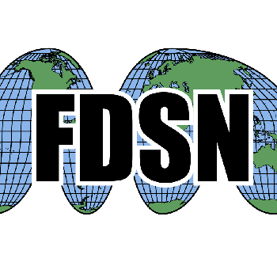
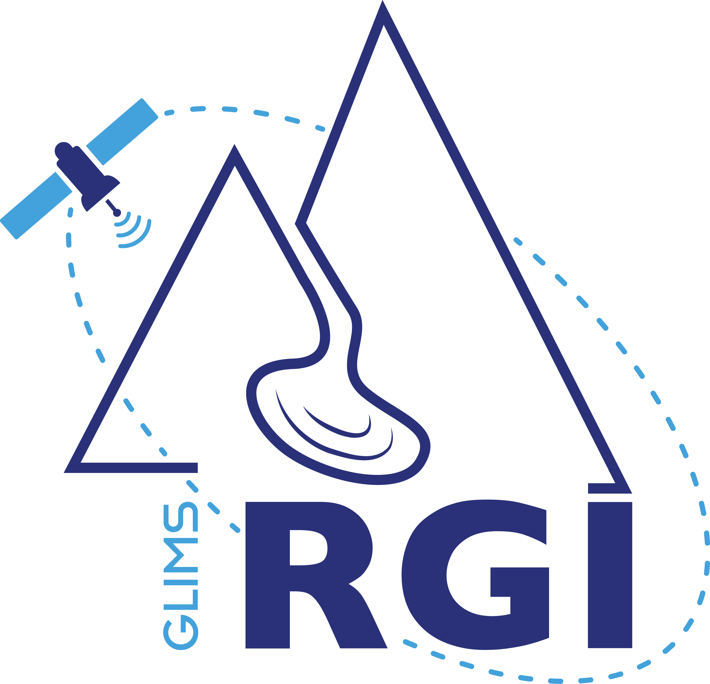
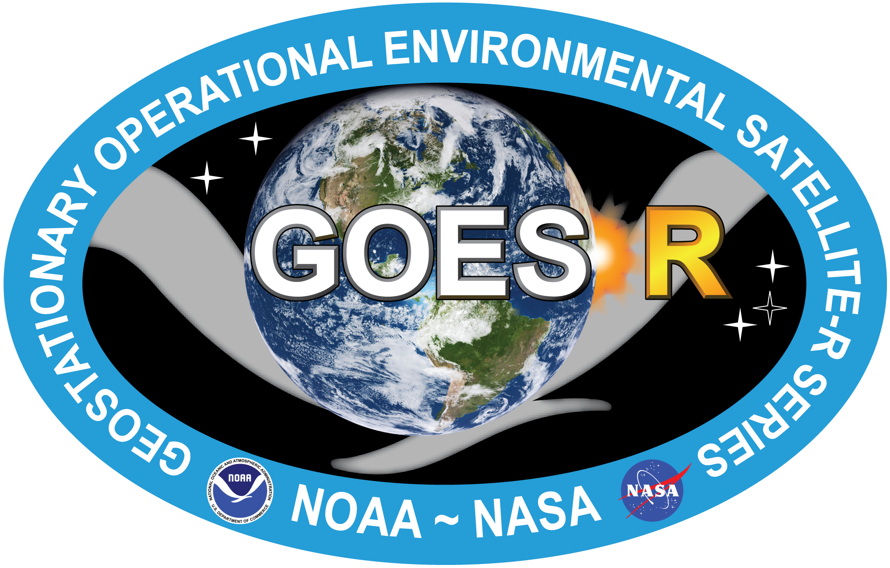
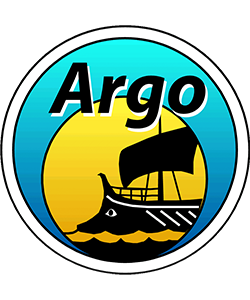
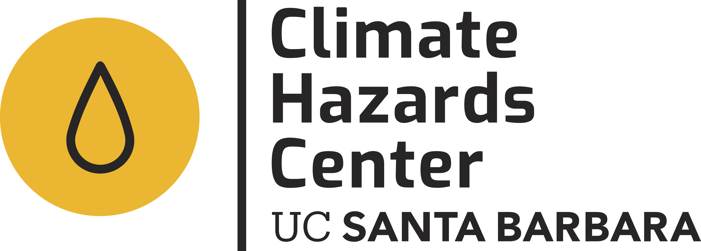
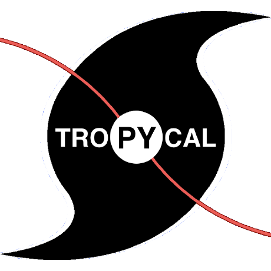
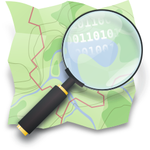
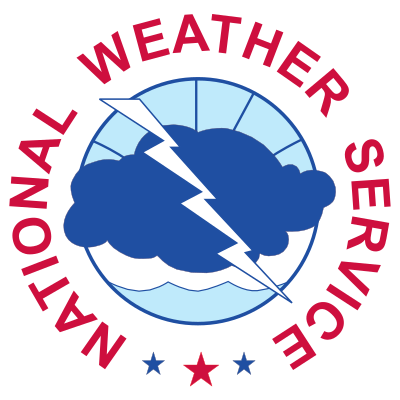

# Data Sources

## Design Concept

earthlens is designed following the Template/Factory design pattern to create an abstract class as a template for different data sources.

The main objective is to provide a unified API for all remote sensing data sources, where you only have to worry about the domain of your data (date range and spatial extent) and the package does everything in the backend.

`earthlens` provides a unified API across **61 providers** — see [All supported providers](#all-supported-providers)
below for the full index, or jump straight to a provider's own reference page
(`docs/reference/<id>/introduction.md`) for its full walkthrough.

!!! note
    Many data sources (Google Earth Engine, ECMWF, EUMETSAT, Sentinel Hub, …) require authentication keys. See the [Authentication](authentication.md) page for setup instructions, or each provider's own reference page for provider-specific credential details.

The API takes a few parameters to determine the domain of your data:

- **Date range**: `start`, `end`, and `temporal_resolution`
- **Spatial extent**: `lat_lim` (latitude limits) and `lon_lim` (longitude limits)
- If `lat_lim` and `lon_lim` are not provided, the `EarthLens` class defaults to longitude `[-180, 180]` and latitude `[-90, 90]`.

```python
from earthlens.core import EarthLens

start = "2009-01-01"
end = "2009-01-10"
temporal_resolution = "daily"
latlim = [4.19, 4.64]
lonlim = [-75.65, -74.73]
```

Each data source has different climate variables/datasets. To discover available variables, use the `Catalog` class for each data source (see [Data Catalog](catalog.md)).

!!! info
    The downloaded data format differs based on the data source. CHIRPS and ECMWF have a `post_download` function that converts the NetCDF format into GeoTIFF using the [pyramids](https://github.com/serapeum-org/pyramids) GIS package.

!!! note
    In future versions, `lat_lim` and `lon_lim` will be deprecated and replaced by a GeoDataFrame containing a polygon geometry.

## All supported providers

Each provider's `id` links to its own reference page for the full walkthrough, authentication details, and catalog. Pass the `data_source` value to `EarthLens(...)`.

### Air quality

| | Provider | `data_source` |
|---|---|---|
|  | [AirNow (US EPA)](../reference/airnow/introduction.md) | `airnow` |
|  | [European Environment Agency](../reference/eea-aq/introduction.md) | `eea-aq` |
|  | [OpenAQ](../reference/openaq/introduction.md) | `openaq` |
|  | [Sensor.Community](../reference/sensor-community/introduction.md) | `sensor-community` |

### Biodiversity & protected areas

| | Provider | `data_source` |
|---|---|---|
|  | [GBIF](../reference/gbif/introduction.md) | `gbif` |
|  | [IUCN Red List](../reference/iucn/introduction.md) | `iucn` |
|  | [OBIS](../reference/obis/introduction.md) | `obis` |
|  | [Protected Planet (UNEP-WCMC)](../reference/wdpa/introduction.md) | `wdpa` |

### Climate reanalysis & projections

| | Provider | `data_source` |
|---|---|---|
|  | [Copernicus Climate Data Store (ECMWF)](../reference/ecmwf/introduction.md) | `ecmwf` |
|  | [NOAA Physical Sciences Laboratory](../reference/climate_indices/introduction.md) | `climate-indices` |
|  | [WCRP CMIP6](../reference/cmip6/introduction.md) | `cmip6` |

### Disasters & risk

| | Provider | `data_source` |
|---|---|---|
|  | [FDSN](../reference/fdsn/introduction.md) | `fdsn` |
|  | [GDACS](../reference/gdacs/introduction.md) | `gdacs` |
|   | [EM-DAT disaster impacts](../reference/emdat/introduction.md) | `emdat`, `gdis` |
|  | [NASA FIRMS](../reference/firms/introduction.md) | `firms` |
|  | [ThinkHazard! (GFDRR/World Bank)](../reference/risk_indicators/introduction.md) | `thinkhazard` |

### Elevation & bathymetry

| | Provider | `data_source` |
|---|---|---|
|  | [Copernicus DEM (ESA)](../reference/dem/introduction.md) | `dem` |
|  | [GEBCO](../reference/bathymetry/introduction.md) | `bathymetry` |

### Glaciers & cryosphere

| | Provider | `data_source` |
|---|---|---|
|  | [NSIDC Randolph Glacier Inventory](../reference/glaciers/introduction.md) | `glaciers` |

### Humanitarian data

| | Provider | `data_source` |
|---|---|---|
|  | [Humanitarian Data Exchange (UN OCHA)](../reference/hdx/introduction.md) | `hdx` |

### Hydrology

| | Provider | `data_source` |
|---|---|---|
|   | [GloH2O MSWEP / MSWX](../reference/mswep/introduction.md) | `mswep`, `mswx` |
|   | [NOAA National Water Model](../reference/nwm/introduction.md) | `nwm` |
|  | [USGS National Water Information System](../reference/usgs-water/introduction.md) | `usgs-water` |

### Multi-mission imagery & data platforms

| | Provider | `data_source` |
|---|---|---|
|  | [AWS Open Data](../reference/s3/introduction.md) | `amazon-s3` |
|  | [EUMETSAT](../reference/eumetsat/introduction.md) | `eumetsat` |
|  | [Google Earth Engine](../reference/gee/introduction.md) | `gee` |
|  | [JAXA](../reference/jaxa/introduction.md) | `jaxa` |
|  | [NASA Earthdata](../reference/earthdata/introduction.md) | `earthdata` |
|  | [NOAA GOES-R](../reference/goes/introduction.md) | `goes` |
|  | [STAC (SpatioTemporal Asset Catalog)](../reference/stac/introduction.md) | `stac` |
|  | [Sentinel Hub](../reference/sentinel-hub/introduction.md) | `sentinel-hub` |
|  | [openEO](../reference/openeo/introduction.md) | `openeo` |

### Ocean

| | Provider | `data_source` |
|---|---|---|
|  | [Argo Program](../reference/argo/introduction.md) | `argo` |
|  | [Copernicus Marine Service](../reference/cmems/introduction.md) | `cmems` |
|  | [NOAA ERDDAP](../reference/erddap/introduction.md) | `erddap` |

### Population & human settlement

| | Provider | `data_source` |
|---|---|---|
|   | [European Commission Joint Research Centre (GHSL)](../reference/ghsl/introduction.md) | `ghsl` |
|  | [WorldPop](../reference/worldpop/introduction.md) | `worldpop` |

### Precipitation & drought

| | Provider | `data_source` |
|---|---|---|
|  | [Climate Hazards Center (UCSB)](../reference/chc/introduction.md) | `chc` |
|  | [Copernicus European Drought Observatory / NDMC](../reference/drought/introduction.md) | `drought` |

### Renewable energy

| | Provider | `data_source` |
|---|---|---|
|  | [Global Solar Atlas / Global Wind Atlas (World Bank/ESMAP)](../reference/solar_wind_atlas/introduction.md) | `solar-wind-atlas` |
|  | [National Laboratory of the Rockies (formerly NREL)](../reference/nrel/introduction.md) | `nrel` |
|  | [PVGIS (EU JRC)](../reference/pvgis/introduction.md) | `pvgis` |

### SAR / radar imagery

| | Provider | `data_source` |
|---|---|---|
|  | [Alaska Satellite Facility (ASF)](../reference/asf/introduction.md) | `asf` |

### Soil

| | Provider | `data_source` |
|---|---|---|
|  | [ISRIC SoilGrids](../reference/soilgrids/introduction.md) | `soilgrids` |

### Tropical cyclones

| | Provider | `data_source` |
|---|---|---|
|  | [Tropycal](../reference/tropycal/introduction.md) | `tropycal` |

### Vector basemaps & boundaries

| | Provider | `data_source` |
|---|---|---|
|  | [OpenStreetMap](../reference/osm/introduction.md) | `osm` |
|  | [Overture Maps Foundation](../reference/overture/introduction.md) | `overture` |
|   | [geoBoundaries](../reference/admin/introduction.md) | `admin` |

### Weather forecast (NWP)

| | Provider | `data_source` |
|---|---|---|
|  | [Herbie (NWP archive access)](../reference/nwp/introduction.md) | `nwp` |

### Weather radar

| | Provider | `data_source` |
|---|---|---|
|  | [NOAA NEXRAD](../reference/radar/introduction.md) | `radar` |

Logos are each provider's own mark, used only to identify which service a backend talks to (not
an endorsement of earthlens by that provider) — see
[docs/_images/logos/ATTRIBUTION.md](https://github.com/serapeum-org/earthlens/blob/main/docs/_images/logos/ATTRIBUTION.md)
for sourcing and rights notes on every logo.

## Quick examples

A few backends' end-to-end usage, worked out in full below. Every other provider's own
[introduction](#all-supported-providers) page has the same kind of walkthrough.

## ECMWF (Copernicus Climate Data Store)

The ECMWF backend talks to the Copernicus Climate Data Store via
`cdsapi`. ERA-Interim was retired in 2019 and the public-datasets
endpoint that hosted it was decommissioned in 2023; **ERA5 on CDS is
the production successor** and what every ECMWF retrieve in this
package now hits. Set up your `~/.cdsapirc` first
(see [Authentication](authentication.md)) and accept the licence for
the relevant ERA5 dataset on the CDS website.

```python
source = "ecmwf"
path = "examples/data/era5"
# Variables are addressed by (CDS dataset short name, variable code).
variables = {
    "reanalysis-era5-single-levels": ["2m-temperature"],
}

earthlens = EarthLens(
    data_source=source,
    start=start,
    end=end,
    variables=variables,
    lat_lim=latlim,
    lon_lim=lonlim,
    temporal_resolution=temporal_resolution,
    path=path,
)
earthlens.download()
```

!!! note "Expect to wait"
    `client.retrieve()` blocks until the request reaches the front of
    the CDS queue and the file is generated — typically minutes,
    occasionally longer for large requests. Pick a small bbox and date
    range to keep wait times bearable. In CI the cdsapi client is
    mocked; the live end-to-end suite is selected with `pytest -m e2e`.

## CHC (CHIRPS / CHIRP / CHIRTS / …)

```python
source = "chc"
path = "examples/data/chirps"
variables = ["precipitation"]

earthlens = EarthLens(
    data_source=source,
    start=start,
    end=end,
    variables=variables,
    lat_lim=latlim,
    lon_lim=lonlim,
    temporal_resolution=temporal_resolution,
    path=path,
)
earthlens.download()
```

### Parallel Download

```python
path = "examples/data/chirps-cores"

earthlens = EarthLens(
    data_source=source,
    start=start,
    end=end,
    variables=variables,
    lat_lim=latlim,
    lon_lim=lonlim,
    temporal_resolution=temporal_resolution,
    path=path,
)
earthlens.download(cores=4)
```

## Amazon S3

```python
path = "examples/data/s3-backend"
source = "amazon-s3"
variables = ["precipitation"]

earthlens = EarthLens(
    data_source=source,
    start=start,
    end=end,
    variables=variables,
    temporal_resolution=temporal_resolution,
    path=path,
)
earthlens.download()
```
