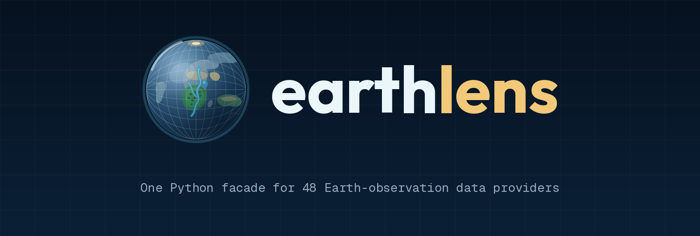
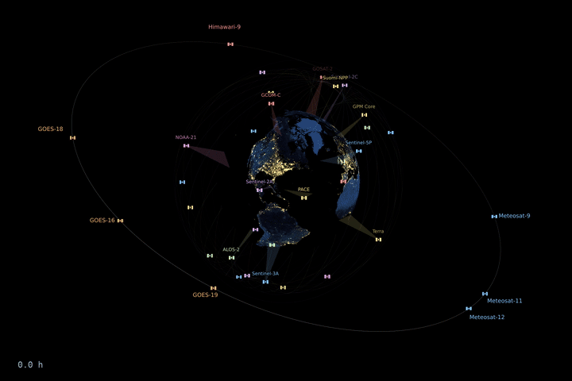
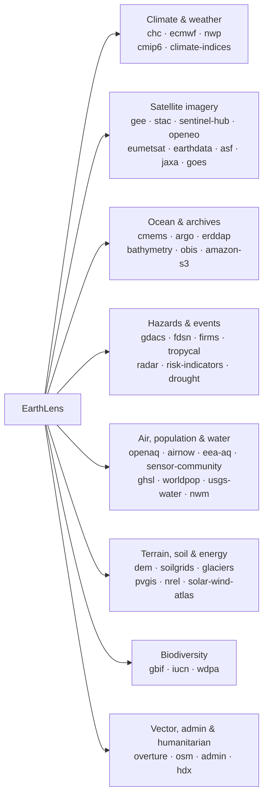
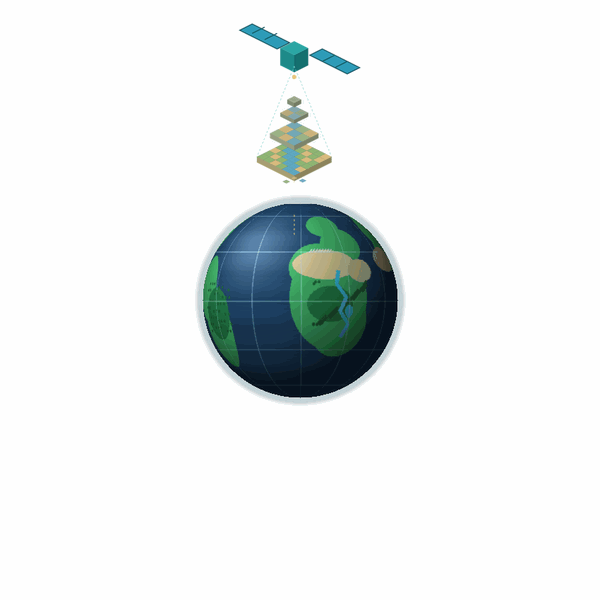

# earthlens

[](https://serapeum-org.github.io/earthlens/)
[](https://badge.fury.io/py/earthlens)
[](https://anaconda.org/conda-forge/earthlens)

[](https://www.gnu.org/licenses/gpl-3.0)
[](https://github.com/pre-commit/pre-commit)
[](https://codecov.io/gh/serapeum-org/earthlens)

**earthlens** is a Python package providing a single, unified API for downloading
satellite, climate, and geospatial data from **61 providers** — climate
reanalysis, satellite imagery, ocean models, weather forecasts, natural-hazard
feeds, air quality, biodiversity, population, and more. Pick a `data_source`, describe the area
and dates you want, and call `download()`; the matching backend handles auth,
catalog lookup, request shaping, and writing the output.

<figure markdown>
  <video controls autoplay loop muted playsinline width="100%"
         poster="_images/animation/earthlens-satellites-night.gif">
    <source src="_images/animation/earthlens-satellites-night-1280.mp4" type="video/mp4">
    
  </video>

<figcaption markdown>
34 of the spacecraft behind earthlens' providers, drawn on their published orbits. Each trailing band is
that instrument's real ground swath, and the trapezoid above it is the sensor's footprint sweeping it out.

The clock counts **simulated orbital time at 270&times; real**: the 20-second clip covers 1.5 hours. Earth
turns 22.6&deg; in that window and a low orbiter completes about nine tenths of a circuit, which is how its
~90-minute period can be read straight off the screen. The geostationary satellites appear frozen because
they are turning at exactly Earth's rate, holding station over the same ground.
</figcaption>
</figure>

<script>
  // A reader who has asked for reduced motion should not be handed a looping
  // clip. autoplay is an attribute rather than a style, so CSS cannot reach it;
  // dropping it leaves the poster frame and the controls already on the player.
  (function () {
    if (!window.matchMedia || !matchMedia("(prefers-reduced-motion: reduce)").matches) return;
    document.querySelectorAll("video[autoplay]").forEach(function (v) {
      v.removeAttribute("autoplay");
      v.pause();
    });
  })();
</script>

## Supported data sources

Every backend is reached through the same `EarthLens` facade by passing its key
as `data_source=`.

| Domain | Provider (`data_source` key) |
|--------|------------------------------|
| **Climate & weather** | Climate Hazards Center — CHIRPS / CHIRTS / SPI / SPEI (`chc`) · ECMWF Copernicus CDS (`ecmwf`) · Open NWP forecasts — GFS / ICON / ECMWF Open Data (`nwp`) · CMIP6 climate projections (`cmip6`) · NOAA PSL teleconnection indices (`climate-indices`) |
| **Satellite imagery & EO platforms** | Google Earth Engine (`gee`) · STAC — Planetary Computer / Earth Search / CDSE (`stac`) · Sentinel Hub server-side render (`sentinel-hub`) · openEO server-side processing (`openeo`) · EUMETSAT Data Store (`eumetsat`) · NASA Earthdata (`earthdata`) · Alaska Satellite Facility SAR (`asf`) · JAXA Earth observation (`jaxa`) · NOAA GOES-R ABI (`goes`) |
| **Ocean & marine** | Copernicus Marine — CMEMS (`cmems`) · Argo float profiles (`argo`) · ERDDAP servers (`erddap`) · Bathymetry — GEBCO / ETOPO (`bathymetry`) · OBIS marine occurrences (`obis`) |
| **Cloud-hosted archives** | AWS Open Data — ERA5 / Sentinel-2 / Copernicus DEM / ESA WorldCover (`amazon-s3`) |
| **Natural hazards & events** | GDACS disaster alerts (`gdacs`) · FDSN earthquakes (`fdsn`) · FIRMS active fires (`firms`) · Tropycal cyclone tracks (`tropycal`) · NEXRAD radar (`radar`) · Risk indicators — ThinkHazard! / INFORM / GFW (`risk-indicators`) · Drought — USDM / EDO / GDO / SPEIbase (`drought`) |
| **Air quality** | OpenAQ — global aggregator (`openaq`) · AirNow — US/Canada EPA (`airnow`) · EEA — Europe (`eea-aq`) · Sensor.Community — crowdsourced (`sensor-community`) |
| **Population & settlement** | JRC Global Human Settlement Layer (`ghsl`) · WorldPop (`worldpop`) |
| **Hydrology** | USGS Water — NWIS (`usgs-water`) · NOAA National Water Model (`nwm`) |
| **Terrain, soil & cryosphere** | Copernicus DEM (`dem`) · ISRIC SoilGrids (`soilgrids`) · Glaciers — RGI / GLIMS / WGMS (`glaciers`) |
| **Energy resource** | PVGIS — EU JRC (`pvgis`) · NREL NSRDB / WIND Toolkit (`nrel`) · Global Solar & Wind Atlas (`solar-wind-atlas`) |
| **Biodiversity & conservation** | GBIF species occurrences (`gbif`) · IUCN Red List (`iucn`) · Protected Planet — WDPA (`wdpa`) |
| **Vector, admin & humanitarian** | Overture Maps basemap (`overture`) · OpenStreetMap features (`osm`) · Administrative boundaries (`admin`) · Humanitarian Data Exchange — HDX (`hdx`) |



See [Supported providers](reference/providers.md) for the full matrix, and the
per-provider pages under **Data Sources** for catalogs, authentication, and usage.

<p align="center">
  
</p>

<p align="center"><em>
  A satellite captures Earth-observation data, which resolves down through a pyramid of raster overview
  tiles — the <a href="https://github.com/serapeum-org/pyramids">pyramids</a> lineage — onto a living globe.<br>
  The name is the story: <strong>earth + lens</strong>.
</em></p>

## Quick Start

```python
from earthlens.core import EarthLens

earthlens = EarthLens(
    data_source="chc",
    temporal_resolution="daily",
    start="2009-01-01",
    end="2009-01-10",
    variables=["precipitation"],
    lat_lim=[4.19, 4.64],
    lon_lim=[-75.65, -74.73],
    path="examples/data/chirps",
)
earthlens.download()
```

## Installation

=== "conda"

    ```bash
    conda install -c conda-forge earthlens
    ```

=== "pip"

    ```bash
    pip install earthlens
    ```

=== "GitHub"

    ```bash
    pip install git+https://github.com/serapeum-org/earthlens.git
    ```
