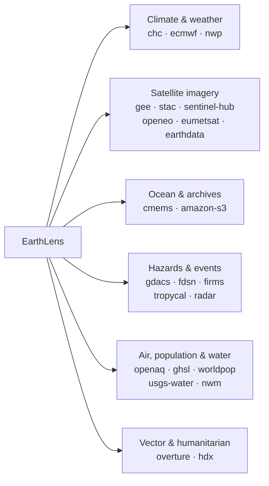

# earthlens

[](https://serapeum-org.github.io/earthlens/)
[](https://badge.fury.io/py/earthlens)
[](https://anaconda.org/conda-forge/earthlens)

[](https://www.gnu.org/licenses/gpl-3.0)
[](https://github.com/pre-commit/pre-commit)
[](https://codecov.io/gh/serapeum-org/earthlens)

**earthlens** is a Python package providing a single, unified API for downloading
satellite, climate, and geospatial data from **23 providers** — climate
reanalysis, satellite imagery, ocean models, weather forecasts, natural-hazard
feeds, air quality, population, and more. Pick a `data_source`, describe the area
and dates you want, and call `download()`; the matching backend handles auth,
catalog lookup, request shaping, and writing the output.

## Supported data sources

Every backend is reached through the same `EarthLens` facade by passing its key
as `data_source=`.

| Domain | Provider (`data_source` key) |
|--------|------------------------------|
| **Climate & weather** | Climate Hazards Center — CHIRPS / CHIRTS / SPI / SPEI (`chc`) · ECMWF Copernicus CDS (`ecmwf`) · Open NWP forecasts — GFS / ICON / ECMWF Open Data (`nwp`) |
| **Satellite imagery & EO platforms** | Google Earth Engine (`gee`) · STAC — Planetary Computer / Earth Search / CDSE (`stac`) · Sentinel Hub server-side render (`sentinel-hub`) · openEO server-side processing (`openeo`) · EUMETSAT Data Store (`eumetsat`) · NASA Earthdata (`earthdata`) |
| **Ocean & marine** | Copernicus Marine — CMEMS (`cmems`) |
| **Cloud-hosted archives** | AWS Open Data — ERA5 / Sentinel-2 / Copernicus DEM / ESA WorldCover (`amazon-s3`) |
| **Natural hazards & events** | GDACS disaster alerts (`gdacs`) · FDSN earthquakes (`fdsn`) · FIRMS active fires (`firms`) · Tropycal cyclone tracks (`tropycal`) · NEXRAD radar (`radar`) |
| **Air quality** | OpenAQ (`openaq`) |
| **Population & settlement** | JRC Global Human Settlement Layer (`ghsl`) · WorldPop (`worldpop`) |
| **Hydrology** | USGS Water — NWIS (`usgs-water`) · NOAA National Water Model (`nwm`) |
| **Vector & humanitarian** | Overture Maps basemap (`overture`) · Humanitarian Data Exchange — HDX (`hdx`) |



See [Supported providers](reference/providers.md) for the full matrix, and the
per-provider pages under **Data Sources** for catalogs, authentication, and usage.

## Quick Start

```python
from earthlens.earthlens import EarthLens

earthlens = EarthLens(
    data_source="chc",
    temporal_resolution="daily",
    start="2009-01-01",
    end="2009-01-10",
    variables=["precipitation"],
    lat_lim=[4.19, 4.64],
    lon_lim=[-75.65, -74.73],
    path="examples/data/chirps",
)
earthlens.download()
```

## Installation

=== "conda"

    ```bash
    conda install -c conda-forge earthlens
    ```

=== "pip"

    ```bash
    pip install earthlens
    ```

=== "GitHub"

    ```bash
    pip install git+https://github.com/serapeum-org/earthlens.git
    ```
