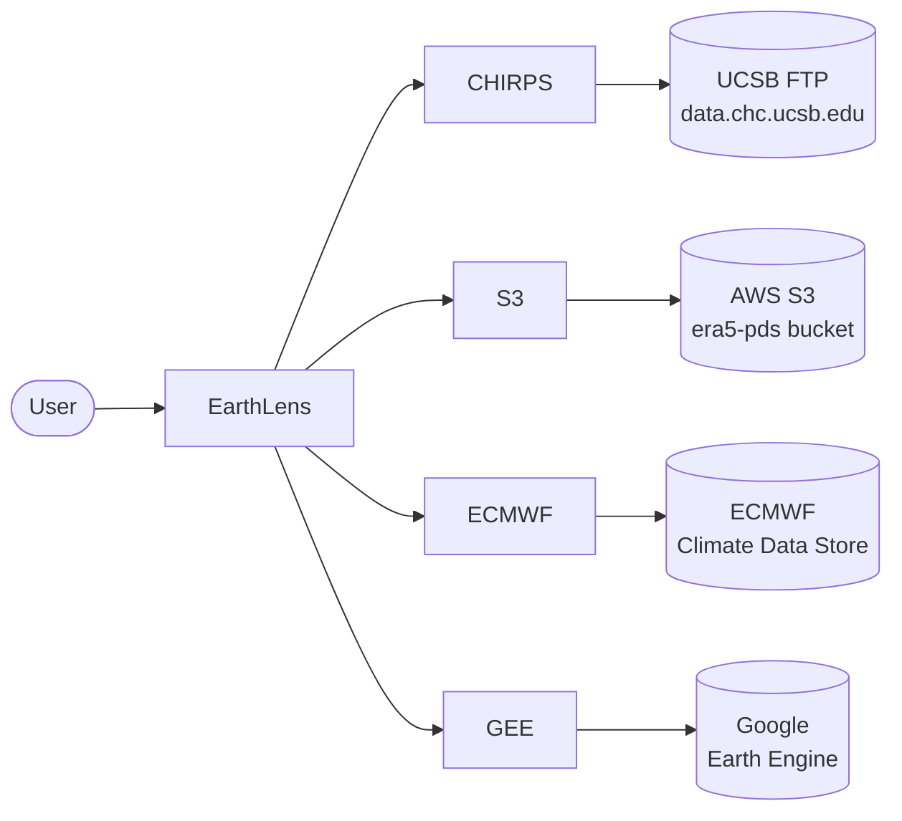
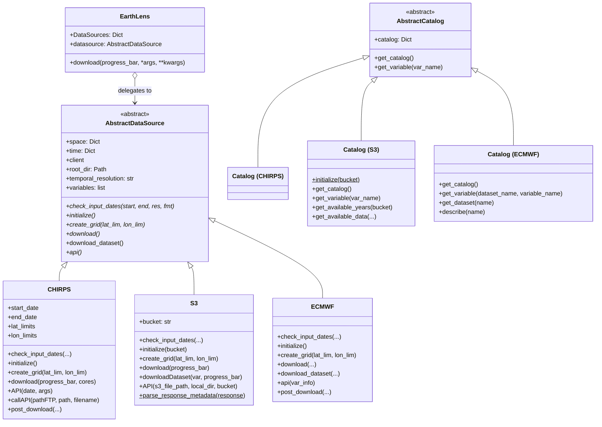
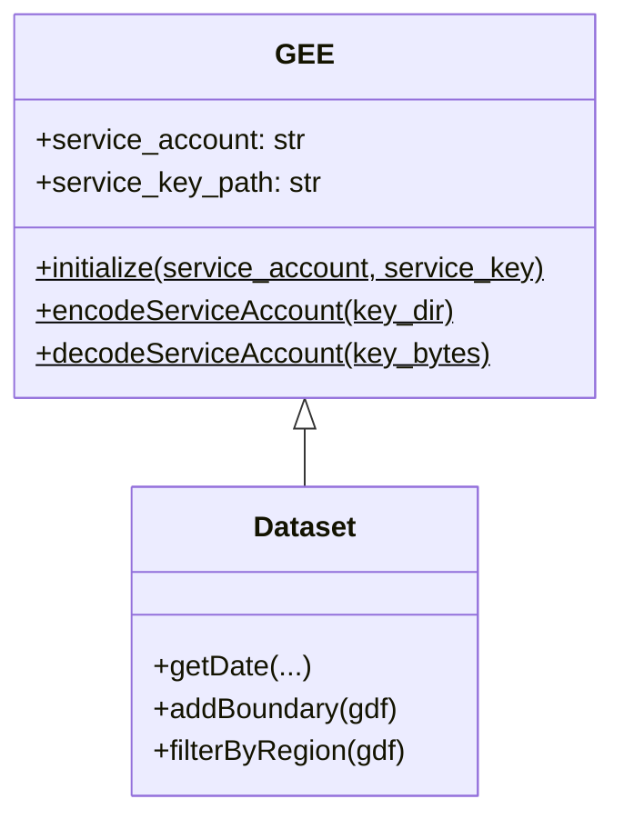
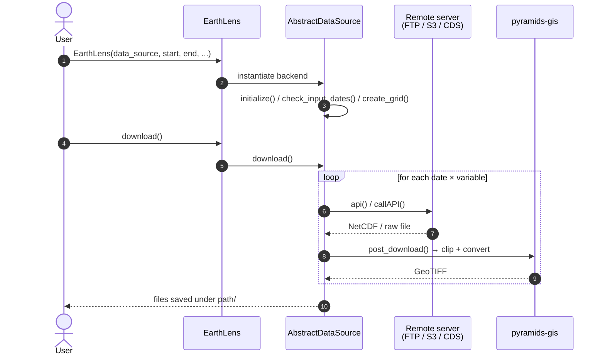
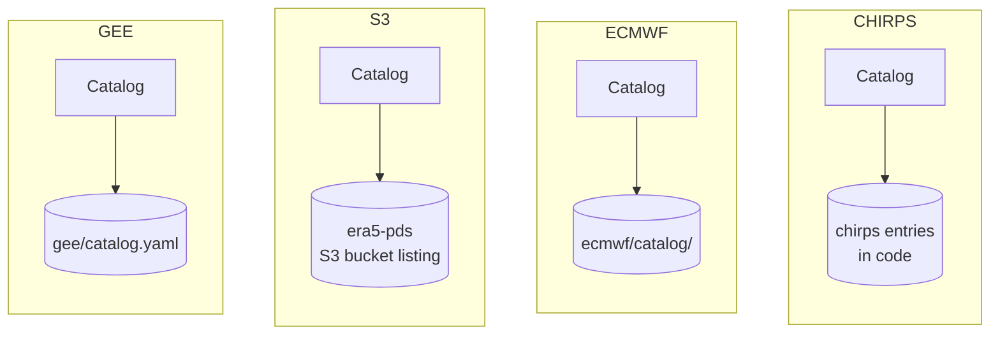

# Architecture

This page documents the internal architecture of `earthlens` using [Mermaid](https://mermaid.js.org/) diagrams. It replaces the original draw.io class diagram.

## System Overview

The `EarthLens` facade exposes a uniform API on top of several concrete data-source backends. Each backend implements the `AbstractDataSource` interface, and each has a companion `Catalog` class that describes available variables.

## Class Diagram

The core abstraction is `AbstractDataSource`. Concrete classes `CHIRPS`, `S3`, `ECMWF`, and the `GEE` subpackage implement it. `AbstractCatalog` plays the same role for the variable/dataset metadata catalogs.

## GEE Subpackage

The Google Earth Engine backend lives in its own subpackage and has a different shape: rather than implementing `AbstractDataSource`, it wraps the `earthengine-api` client directly through a small class hierarchy.

## Download Sequence

The user calls `EarthLens.download()`, which delegates to the selected backend. Each backend follows the same high-level sequence: authenticate / open a session, iterate over dates × variables, fetch, and post-process.

## Catalog Pattern

Every data source has a companion `Catalog` class that loads variable metadata from a YAML file (for CHIRPS and ECMWF) or introspects the remote bucket (for S3).

## Subpackage layout & style

Every provider backend under `src/earthlens/<pkg>/` follows one layout so the
backends read the same way; a new backend should match it.

### Module layout

| File | Role |
|------|------|
| `__init__.py` | Module docstring (required) + `__all__`; re-exports the public surface. |
| `backend.py` | The `AbstractDataSource` subclass `<Provider>`. Always `backend.py` — never `<pkg>.py`. |
| `catalog.py` | The catalog loader (see below). |
| `catalog/` **or** `<pkg>_data_catalog.yaml` | The catalog data (see "Catalog storage"). |
| `auth.py` | Auth surface, when the provider needs credentials (see "Auth"). |
| `_helpers.py` | Private, stateless helpers (optional). |
| `events.py` | Vector-event → `FeatureCollection` builders (vector backends only). |
| `providers.yaml` | Provider registry (backends that populate the base `providers` field). |

Per-backend tooling lives at repo-level `tools/<pkg>/`; tests in `tests/<pkg>/`
(or `tests/test_<pkg>/`). Backend-specific extras (e.g. `gee/filters.py`,
`ecmwf/constraints.py`, `sentinel_hub/evalscripts/`) sit alongside these.

### Catalog storage

Which storage shape a backend uses is decided by a rule, not ad hoc:

- **Sharded `catalog/` directory** — per-family `<family>.yaml` files plus an
  `_index.yaml` holding the informational `available_*` index. Used for large
  or multi-family catalogs (gee, cmems, earthdata, eumetsat, stac, openeo,
  sentinel_hub, ghsl, chc).
- **Single `<pkg>_data_catalog.yaml`** at the package root — for a small,
  single-family enumeration (fdsn, gdacs, firms, radar, tropycal, openaq,
  usgs_water, overture, nwp, s3, worldpop).
- **Large-index variant** — when the upstream "every dataset" index is too big
  to keep inline it lives in a sibling gzipped/plain JSON kept out of the
  `*.yaml` glob (earthdata `catalog/_auto.json`, hdx `catalog/_available.json.gz`)
  while the curated rows stay in `*.yaml`.

Both shapes load through the same loader, which also accepts a single `*.yaml`
file (used by tests that monkey-patch `CATALOG_PATH`).

### Catalog loader API

`catalog.py` always exposes a module-level `CATALOG_PATH`, a
`clear_catalog_cache()` helper, a `(path, mtime_ns)` parse cache, and a pydantic
`Catalog` class (radar keeps a `StationCatalog` alias) that subclasses
`AbstractCatalog`, chains `super().model_post_init()`, and parses through the
shared `earthlens.base.yaml_loader.load_yaml_strict`.

### Auth

When a provider needs credentials the auth surface lives in `auth.py` as a
`<Provider>Auth` + `<Provider>Credentials` pair with env-var fallbacks, raising
`AuthenticationError` on failure. Sanctioned exceptions: a multi-endpoint
backend may use a signer model instead (stac: `signers.py` + `auth_cdse.py`),
and a backend whose SDK owns auth (ecmwf via `~/.cdsapirc`) may keep its
`AuthenticationError` in `backend.py`. Public/anonymous backends (chc, gdacs,
hdx, overture, tropycal) have no auth module.
