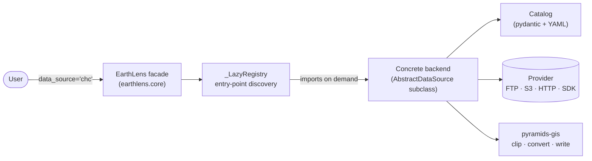
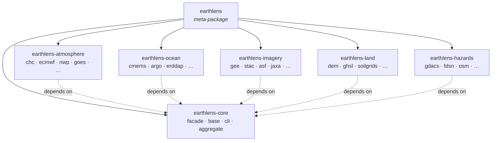
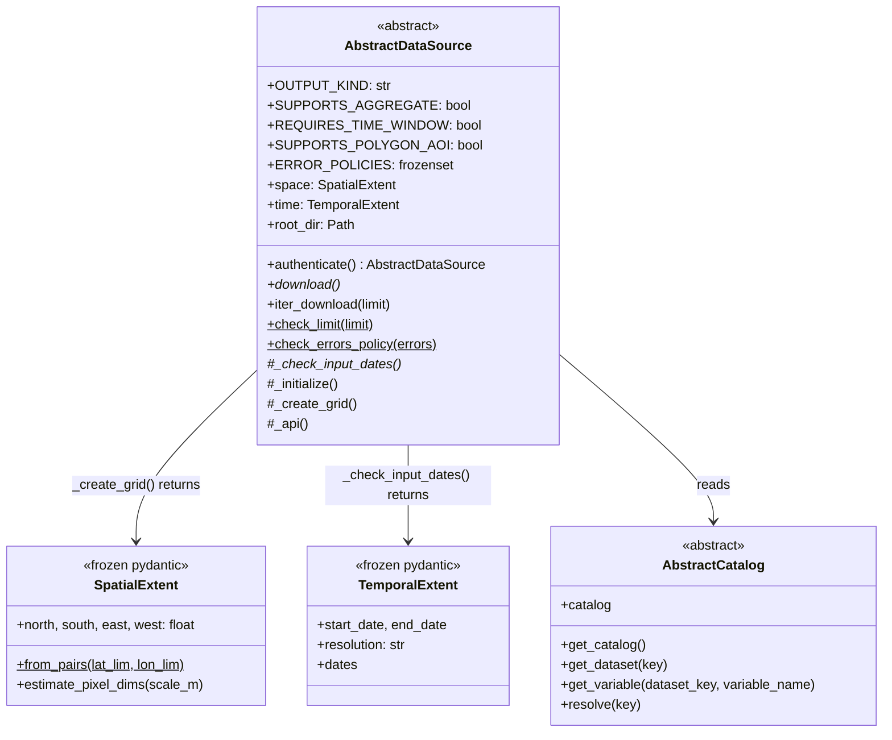
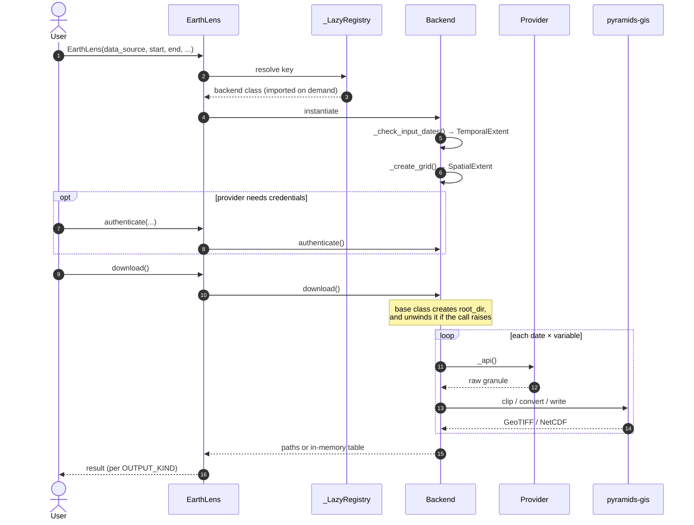
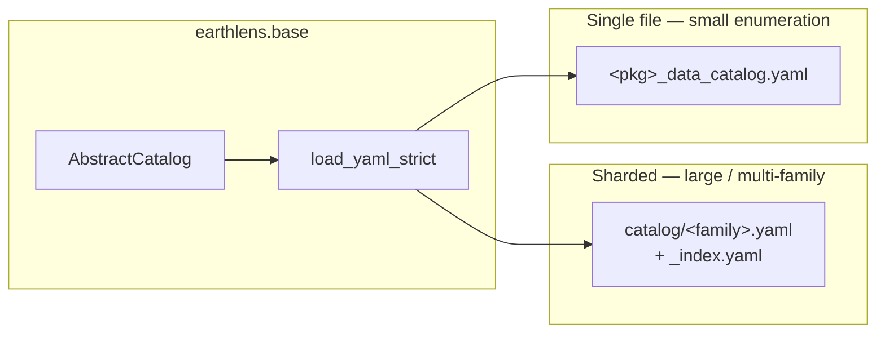

# Architecture

This page documents the internal architecture of `earthlens` using [Mermaid](https://mermaid.js.org/) diagrams:
how the facade, the backend registry, the shared base contracts, and the per-provider catalogs fit together.

## System overview

`EarthLens` is a thin facade. It resolves a `data_source=` key to a backend class, instantiates it with the
request you described, and delegates. Every one of the **61 provider backends** implements the same
`AbstractDataSource` contract, so the call shape does not change when you switch providers.



The registry is **lazy** and **discovered**, not hard-coded. `earthlens._backends.discover_backends()` merges the
`[project.entry-points."earthlens.backends"]` table that each provider distribution publishes, so core names no
backend and the optional SDK for a provider you never touch is never imported.

```python
from earthlens.core import sources

sources()          # the 48 canonical keys — aliases resolve but are not listed
```

## Distribution & namespace layout

`earthlens` is a **PEP 420 namespace package** — there is no `earthlens/__init__.py`. Seven distributions each
contribute their own `earthlens.<name>` subpackages into one namespace, and the repository is a
[uv](https://docs.astral.sh/uv/) workspace whose members they are.



The public surface is **`earthlens.core`**, not the top level:

```python
from earthlens.core import EarthLens, download, find, search, sources
from earthlens.core import AggregationConfig, aggregate_netcdf, __version__
```

`from earthlens import EarthLens` does **not** work — it required the `__init__.py` that the namespace layout
removes. Backend modules keep their dotted paths (`earthlens.chc`, `earthlens.gee`, …), which is how you reach a
provider's `Catalog`.

## The data-source contract

`AbstractDataSource` is the core abstraction. Only **two** members are abstract — `download()` and
`_check_input_dates()`; everything else is a hook with a working default, which is why a new backend is usually a
small class.

The lifecycle hooks are **private by design**. Users call `download()`; the base class drives the rest.



`_create_grid()` and `_check_input_dates()` return frozen pydantic value objects, which the base class captures
into `self.space` and `self.time` — they are not plain dicts.

### `OUTPUT_KIND`

Each backend declares what it produces, and that attribute drives the facade's behaviour:

| `OUTPUT_KIND` | `download()` returns | `aggregate=` |
|---|---|---|
| `raster` | `list[Path]` — GeoTIFF / NetCDF / COG | if `SUPPORTS_AGGREGATE` |
| `mixed` | varies per request | if `SUPPORTS_AGGREGATE` |
| `vector` | `FeatureCollection` / `GeoDataFrame` | rejected |
| `tabular` | `DataFrame` | rejected |

`aggregate=` needs **both** an `OUTPUT_KIND` of `raster` or `mixed` and a `SUPPORTS_AGGREGATE` declaration —
`OUTPUT_KIND` alone does not decide it. A raster backend that has not wired the reducer is refused just as a
`vector` one is, with a `NotImplementedError` raised before `download` runs.

`download()` never returns `None`.

## Download sequence



## Catalog pattern

Nearly every backend has a companion `Catalog` — a pydantic model loading YAML shipped as package data, parsed
through the shared duplicate-key-rejecting loader `earthlens.base.yaml_loader.load_yaml_strict`.



Which shape a backend uses is decided by the rule in [Catalog storage](#catalog-storage) below, not ad hoc. A few
catalogs additionally probe the provider at request time to resolve what a shipped row expands to, but the
curated rows themselves are always shipped — S3's live in `s3_data_catalog.yaml` like every other backend's.

## Shared base services

`earthlens.base` holds the contracts and the cross-backend plumbing, so a provider backend stays small:

| Module | Role |
|---|---|
| `abstractdatasource.py` | `AbstractDataSource`, `AbstractCatalog`, `SpatialExtent`, `TemporalExtent` |
| `http.py` | `HttpClient` — pooled, retrying HTTP with URL redaction |
| `region.py` | Region affinity — pick the provider endpoint / mirror nearest the AOI |
| `spatial.py` | AOI normalisation and bbox helpers |
| `auth.py` | `AbstractAuth`, `AuthenticationError` |
| `s3.py` | `S3Auth` / `S3Credentials` for the unsigned and signed bucket backends |
| `catalog_source.py` | Catalog parse cache keyed on `(path, mtime_ns)` |
| `yaml_loader.py` | `load_yaml_strict` — duplicate-key-rejecting YAML |
| `providers.py` | `Provider` registry loaded from per-backend `providers.yaml` |

Generic GIS work — reprojection, resampling, format conversion, visualisation — is **not** here. It belongs to
[pyramids](https://github.com/serapeum-org/pyramids), the GIS backend earthlens consumes.

## Subpackage layout & style

Every provider backend under `src/earthlens/<pkg>/` follows one layout so the
backends read the same way; a new backend should match it.

### Module layout

| File | Role |
|------|------|
| `__init__.py` | Module docstring (required) + `__all__`; re-exports the public surface. |
| `backend.py` | The `AbstractDataSource` subclass `<Provider>`. Always `backend.py` — never `<pkg>.py`. |
| `catalog.py` | The catalog loader (see below). |
| `catalog/` **or** `<pkg>_data_catalog.yaml` | The catalog data (see "Catalog storage"). |
| `auth.py` | Auth surface, when the provider needs credentials (see "Auth"). |
| `_helpers.py` | Private, stateless helpers (optional). |
| `events.py` | Vector-event → `FeatureCollection` builders (vector backends only). |
| `providers.yaml` | Provider registry (backends that populate the base `providers` field). |

Per-backend tooling lives at repo-level `tools/<pkg>/`; tests in `tests/<pkg>/`
(or `tests/test_<pkg>/`). Backend-specific extras (e.g. `gee/filters.py`,
`ecmwf/constraints.py`, `sentinel_hub/evalscripts/`) sit alongside these.

### Catalog storage

Which storage shape a backend uses is decided by a rule, not ad hoc:

- **Sharded `catalog/` directory** — per-family `<family>.yaml` files plus an
  `_index.yaml` holding the informational `available_*` index. Used for large
  or multi-family catalogs (gee, cmems, earthdata, eumetsat, stac, openeo,
  sentinel_hub, ghsl, chc).
- **Single `<pkg>_data_catalog.yaml`** at the package root — for a small,
  single-family enumeration (fdsn, gdacs, firms, radar, tropycal, openaq,
  usgs_water, overture, nwp, s3, worldpop).
- **Large-index variant** — when the upstream "every dataset" index is too big
  to keep inline it lives in a sibling gzipped/plain JSON kept out of the
  `*.yaml` glob (earthdata `catalog/_auto.json`, hdx `catalog/_available.json.gz`)
  while the curated rows stay in `*.yaml`.

Both shapes load through the same loader, which also accepts a single `*.yaml`
file (used by tests that monkey-patch `CATALOG_PATH`).

### Catalog loader API

`catalog.py` always exposes a module-level `CATALOG_PATH`, a
`clear_catalog_cache()` helper, a `(path, mtime_ns)` parse cache, and a pydantic
`Catalog` class (radar keeps a `StationCatalog` alias) that subclasses
`AbstractCatalog`, chains `super().model_post_init()`, and parses through the
shared `earthlens.base.yaml_loader.load_yaml_strict`.

### Auth

When a provider needs credentials the auth surface lives in `auth.py` as a
`<Provider>Auth` + `<Provider>Credentials` pair with env-var fallbacks, raising
`AuthenticationError` on failure. Sanctioned exceptions: a multi-endpoint
backend may use a signer model instead (stac: `signers.py` + `auth_cdse.py`),
and a backend whose SDK owns auth (ecmwf via `~/.cdsapirc`) may keep its
`AuthenticationError` in `backend.py`. Public/anonymous backends (chc, gdacs,
hdx, overture, tropycal) have no auth module.
